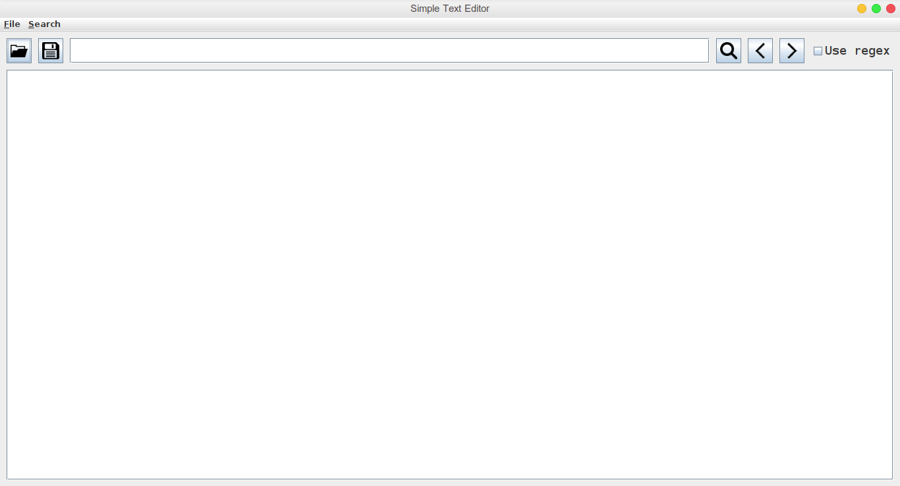
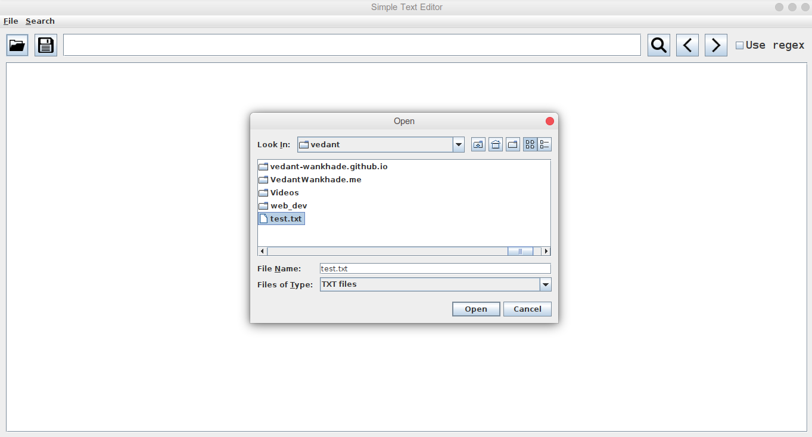
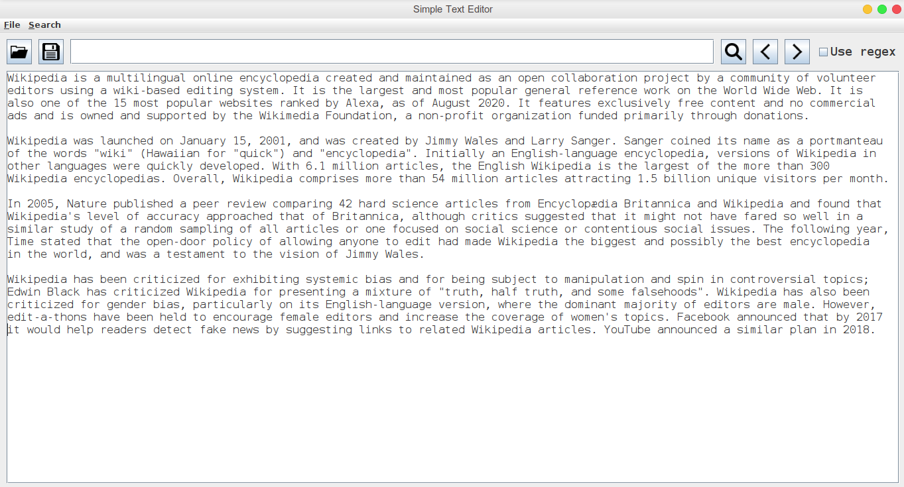
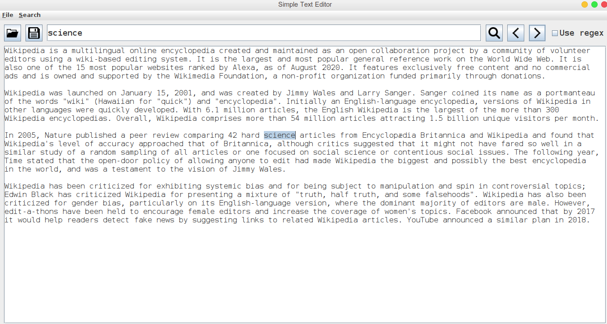

# Simple Text Editor

Simple program to open/save txt files and edit their content.
Also program allows to find all occurences of provided characters (plain text or regular expression) in the text.

This is how it looks!

